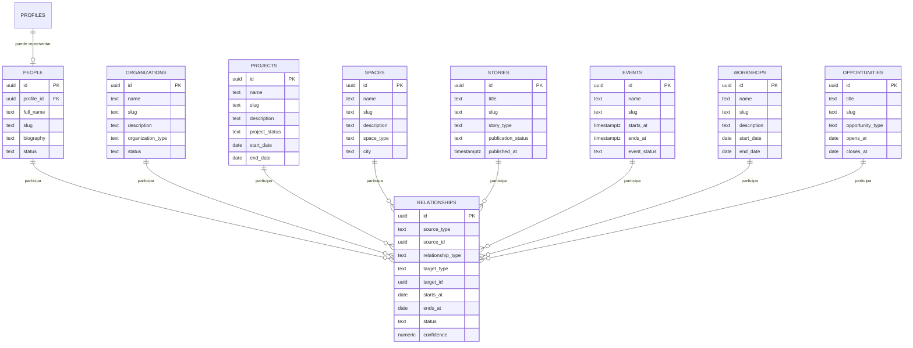

# Cultura Esta
## Entity Relationship Diagram v1

Este documento traduce el modelo conceptual de Cultura Esta a una primera arquitectura técnica.

No representa todavía todas las columnas de la base de datos.

Define las tablas principales, sus responsabilidades y sus conexiones.

---

# Decisión de arquitectura

Cultura Esta utilizará:

1. Tablas específicas para cada tipo de entidad.
2. Identificadores universales para relacionarlas.
3. Una tabla central de relaciones.
4. Tablas auxiliares para recursos, etiquetas y ubicaciones.

No se utilizará una sola tabla genérica para almacenar todo.

Esto permite que cada entidad conserve sus propios atributos y reglas.

---

# Diagrama general



---

# Entidades principales

## profiles

Representa una cuenta con acceso a Cultura Esta.

Responsabilidades:

- autenticación
- autorización
- rol dentro de la plataforma
- acceso al Workspace
- acceso editorial o administrativo

Una cuenta puede estar asociada a una persona del ecosistema.

No toda persona necesita una cuenta.

---

## people

Representa individuos del ecosistema cultural.

Ejemplos:

- artistas
- periodistas
- productores
- fotógrafos
- gestores
- investigadores
- talleristas
- voluntarios

Una persona puede existir sin tener acceso a la plataforma.

---

## organizations

Representa estructuras colectivas o institucionales.

Ejemplos:

- colectivos
- fundaciones
- empresas
- medios
- universidades
- instituciones públicas
- museos

---

## projects

Representa procesos con objetivos, participantes y duración.

Ejemplos:

- festivales
- procesos comunitarios
- producciones audiovisuales
- programas culturales
- investigaciones
- exposiciones colectivas

Un proyecto puede producir eventos, historias, documentos y recursos.

---

## spaces

Representa lugares físicos o híbridos.

Ejemplos:

- galerías
- teatros
- estudios
- talleres
- museos
- parques
- laboratorios
- residencias

---

## stories

Representa contenido editorial producido por Cultura Esta.

Ejemplos:

- artículos
- entrevistas
- documentales
- fotohistorias
- podcasts
- críticas
- columnas

Solo los miembros autorizados de la redacción pueden crear, editar o publicar historias.

---

## events

Representa actividades que ocurren en una fecha y hora determinadas.

Ejemplos:

- conciertos
- inauguraciones
- proyecciones
- presentaciones
- exposiciones
- encuentros
- conversatorios

---

## workshops

Representa procesos formativos.

Se mantiene separado de `events` porque puede tener:

- metodología
- módulos
- participantes
- facilitadores
- resultados
- varias sesiones

Cada sesión concreta podrá relacionarse posteriormente con uno o varios eventos.

---

## opportunities

Representa oportunidades abiertas.

Ejemplos:

- convocatorias
- becas
- residencias
- premios
- empleos
- voluntariados
- llamados artísticos

Se utiliza `opportunities` en lugar de `calls`, porque permite ampliar el sistema más allá de convocatorias institucionales.

---

# Tabla central de relaciones

## relationships

Esta tabla conecta cualquier entidad con otra.

Ejemplo:

```text
source_type: person
source_id: Andrés Franco

relationship_type: directs

target_type: project
target_id: Alta Frecuencia
```

Otro ejemplo:

```text
source_type: story
source_id: Historia sobre Neon Sessions

relationship_type: covers

target_type: project
target_id: Neon Sessions
```

---

# Estructura mínima de una relación

Cada relación debe almacenar:

```text
id
source_type
source_id
relationship_type
target_type
target_id
starts_at
ends_at
status
confidence
source_url
notes
created_by
created_at
updated_at
```

---

# Tipos permitidos de entidad

La primera versión reconocerá:

```text
person
organization
project
space
story
event
workshop
opportunity
```

Posteriormente podrán añadirse:

```text
document
resource
collection
product
service
```

---

# Dirección de las relaciones

Toda relación debe escribirse de manera legible desde el origen hacia el destino.

Correcto:

```text
Persona
dirige
Proyecto
```

Evitar:

```text
Proyecto
es dirigido por
Persona
```

La relación inversa será interpretada por el sistema.

Esto evita almacenar dos veces la misma conexión.

---

# Ejemplos de relaciones

```text
Person — founded → Organization

Person — directs → Project

Person — wrote → Story

Person — photographed → Event

Organization — manages → Space

Organization — develops → Project

Project — occurs_at → Space

Project — produces → Event

Story — covers → Project

Story — mentions → Person

Event — belongs_to → Project

Workshop — facilitated_by → Person

Opportunity — funds → Project
```

---

# Reglas del modelo

1. Una entidad puede existir sin relaciones.
2. Una relación no puede existir sin dos entidades válidas.
3. Las relaciones deben utilizar vocabulario controlado.
4. No deben duplicarse relaciones idénticas activas.
5. Las relaciones históricas no se eliminan; se cierran con `ends_at`.
6. La confianza indica qué tan verificada está una relación.
7. Las historias editoriales no sustituyen a las entidades que cubren.
8. Una cuenta de usuario no equivale automáticamente a una persona pública.
9. Los permisos se aplican por producto y acción, no por existencia de la entidad.
10. La IA podrá sugerir relaciones, pero no publicarlas automáticamente.

---

# Orden de implementación

La base de datos se construirá en este orden:

```text
01. profiles
02. people
03. organizations
04. projects
05. spaces
06. stories
07. events
08. workshops
09. opportunities
10. relationships
```

Las tablas auxiliares vendrán después:

```text
locations
tags
entity_tags
resources
entity_resources
collections
activity_log
```

---

# Principio rector

Las tablas específicas describen qué es cada cosa.

La tabla `relationships` describe cómo se conecta todo.

Cultura Esta no reemplaza la realidad con una estructura genérica.

La organiza sin perder sus diferencias.